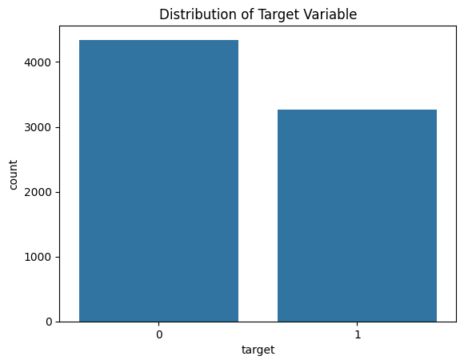
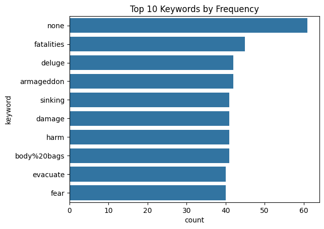

# 🌪️ NLP Disaster Tweets Classification

## 📕 [Link to Project Notebook](https://github.com/Karan-D-Software/NLP-Disaster-Tweets-Classification/blob/main/Project.ipynb) 

## 📚 Table of Contents
1. [Introduction](#introduction)
2. [Problem and Data Description](#problem-and-data-description)
3. [Exploratory Data Analysis (EDA)](#exploratory-data-analysis-eda)
   - [Loading the Data](#loading-the-data)
   - [Data Cleaning Procedures](#data-cleaning-procedures)
   - [Data Visualization](#data-visualization)
      - [Distribution of Target Variable](#distribution-of-target-variable)
      - [Distribution of Tweet Lengths](#distribution-of-tweet-lengths)
      - [Top 10 Keywords by Frequency](#top-10-keywords-by-frequency)
      - [Top 10 Locations by Frequency](#top-10-locations-by-frequency)
   - [Plan of Analysis](#plan-of-analysis)
4. [Model Architecture](#model-architecture)
   - [Model Description and Reasoning](#model-description-and-reasoning)
   - [Code for Sequential Neural Network with LSTM](#code-for-sequential-neural-network-with-lstm)
5. [Results and Analysis](#results-and-analysis)
   - [Run Hyperparameter Tuning](#run-hyperparameter-tuning)
   - [Training the Best Model](#training-the-best-model)
   - [Results](#results)
   - [Discussion](#discussion)
6. [Conclusion](#conclusion)
   - [Summary of Results](#summary-of-results)
   - [Key Findings](#key-findings)
   - [Interpretations](#interpretations)
   - [Learnings and Takeaways](#learnings-and-takeaways)
   - [Future Work](#future-work)
7. [References](#references)

## 📝 Introduction
This project aims to classify disaster-related tweets using Natural Language Processing techniques. It is a part of the Kaggle competition "Natural Language Processing with Disaster Tweets."

## 🔍 Problem and Data Description
The challenge is to build a machine learning model that predicts whether a given tweet is about a real disaster or not. The dataset consists of 10,000 tweets that have been manually classified. Each sample in the dataset includes the text of the tweet, a keyword from the tweet (if available), and the location the tweet was sent from (if available). [Link to Kaggle Competition](https://kaggle.com/competitions/nlp-getting-started).

## 📊 Exploratory Data Analysis (EDA)

### Loading the Data
Let's start by loading the data and taking a look at the first few rows.

```python
import pandas as pd
import matplotlib.pyplot as plt
import seaborn as sns

# Load the dataset
train_df = pd.read_csv('train.csv')
test_df = pd.read_csv('test.csv')

train_df.head()
```
### Data Cleaning Procedures
The data cleaning process involves filling in missing values for the 'keyword' and 'location' columns. Missing keywords are filled with 'none', and missing locations are filled with 'unknown'.

```python
# Data cleaning: fill missing values in 'keyword' and 'location' columns
train_df['keyword'].fillna('none', inplace=True)
train_df['location'].fillna('unknown', inplace=True)
```

### Data Visualization
We performed various visualizations to understand the data better:

1. **Distribution of Target Variable:**
   ```python
   # Display the distribution of the target variable
   sns.countplot(x='target', data=train_df)
   plt.title('Distribution of Target Variable')
   plt.show()
   ```
   

   The distribution of the target variable reveals that there are more non-disaster tweets (labeled as 0) compared to disaster-related tweets (labeled as 1). This class imbalance is crucial to consider as it can affect the model's performance. Techniques such as resampling, adjusting class weights, or using specific evaluation metrics will be necessary to handle this imbalance.

2. **Distribution of Tweet Lengths:**
   ```python
   # Display the distribution of tweet lengths
   train_df['text_length'] = train_df['text'].apply(len)
   sns.histplot(train_df['text_length'], bins=50)
   plt.title('Distribution of Tweet Lengths')
   plt.show()
   ```
   

   The distribution of tweet lengths shows that most tweets are around 120 to 140 characters long. This is expected given the character limit on Twitter. Understanding the length of tweets can help in preprocessing, such as padding or truncating tweets to a fixed length when feeding them into the model.

3. **Top 10 Keywords by Frequency:**
   ```python
   # Display the distribution of keyword occurrences
   sns.countplot(y='keyword', data=train_df, order=train_df['keyword'].value_counts().iloc[:10].index)
   plt.title('Top 10 Keywords by Frequency')
   plt.show()
   ```
   

   The top 10 keywords by frequency include terms like 'fatalities', 'deluge', 'armageddon', and 'sinking', which are strongly associated with disasters. Keywords can serve as important features for the model, providing context about the content of the tweets.

4. **Top 10 Locations by Frequency:**
   ```python
   # Display the distribution of locations
   sns.countplot(y='location', data=train_df, order=train_df['location'].value_counts().iloc[:10].index)
   plt.title('Top 10 Locations by Frequency')
   plt.show()
   ```
   

   The distribution of locations shows that most tweets are from the USA, New York, and other prominent locations. Location data can help in understanding regional patterns in disaster reporting and may enhance the model's ability to correctly classify tweets based on where they originate.

### Plan of Analysis
Based on the exploratory data analysis, the plan for analysis includes:

1. **Text Preprocessing:**
   - Tokenization
   - Stopword removal
   - Stemming/Lemmatization
   - Vectorization (e.g., TF-IDF)

2. **Feature Engineering:**
   - Creating features from tweet lengths, keyword, and location data
   - Exploring additional features like sentiment scores

3. **Model Selection and Training:**
   - Experimenting with various models like Logistic Regression, Naive Bayes, and different neural network architectures
   - Hyperparameter tuning and model optimization

4. **Evaluation:**
   - Evaluating models using metrics like F1-score, precision, recall, and accuracy
   - Analyzing results and refining models based on performance

## 🏗️ Model Architecture

### Model Description and Reasoning

**TF-IDF Vectorization:**
TF-IDF (Term Frequency-Inverse Document Frequency) is a statistical measure used to evaluate the importance of a word in a document relative to a collection of documents (corpus). The TF-IDF value increases proportionally to the number of times a word appears in the document but is offset by the frequency of the word in the corpus, which helps to adjust for the fact that some words appear more frequently in general.

**Neural Network with LSTM:**
We built and trained a sequential neural network using Long Short-Term Memory (LSTM) layers. LSTMs are a type of Recurrent Neural Network (RNN) architecture that are well-suited for sequential data like text because they can capture long-term dependencies. Unlike traditional RNNs, LSTMs are capable of learning and remembering over long sequences, which is crucial for understanding context in text data where the meaning of a word often depends on the words preceding and following it. This ability to retain information over longer periods makes LSTMs particularly effective for natural language processing tasks, such as text classification, where understanding the sequence of words is essential.

We chose LSTM for our model due to its effectiveness in handling the vanishing gradient problem, which is a common issue in standard RNNs. The LSTM architecture includes gates that regulate the flow of information, allowing it to maintain long-term dependencies without losing important information over time. This makes LSTMs more robust for tasks involving longer text sequences. By incorporating bidirectional LSTM layers, our model can capture context from both past and future states, further enhancing its understanding of the text. This bidirectional approach ensures that the model has a more comprehensive view of the text data, improving its ability to accurately classify disaster-related tweets.

### Code for Sequential Neural Network with LSTM

**Import necessary libraries:**
```python
import numpy as np
import pandas as pd
from sklearn.model_selection import train_test_split
from tensorflow.keras.preprocessing.text import Tokenizer
from tensorflow.keras.preprocessing.sequence import pad_sequences
from tensorflow.keras.models import Sequential
from tensorflow.keras.layers import Embedding, LSTM, Dense, Dropout, Bidirectional
from tensorflow.keras.optimizers import Adam
```

**Load and preprocess the dataset:**
```python
# Load the dataset
train_df = pd.read_csv('train.csv')

# Data preprocessing
train_df['keyword'].fillna('none', inplace=True)
train_df['location'].fillna('unknown', inplace=True)
train_df['text'] = train_df['text'].str.lower()

# Split the data into training and testing sets
X = train_df['text']
y = train_df['target']
X_train, X_test, y_train, y_test = train_test_split(X, y, test_size=0.2, random_state=42)
```

**Tokenize and pad sequences:**
```python
# Tokenize the text
tokenizer = Tokenizer(num_words=10000, oov_token='<OOV>')
tokenizer.fit_on_texts(X_train)
word_index = tokenizer.word_index

# Convert text to sequences and pad them
X_train_sequences = tokenizer.texts_to_sequences(X_train)
X_test_sequences = tokenizer.texts_to_sequences(X_test)
X_train_padded = pad_sequences(X_train_sequences, maxlen=100, padding='post', truncating='post')
X_test_padded = pad_sequences(X_test_sequences, maxlen=100, padding='post', truncating='post')
```

**Build and compile the LSTM model:**
```python
# Build the LSTM model
model = Sequential([
    Embedding(input_dim=10000, output_dim=64, input_length=100),
    Bidirectional(LSTM(64, return_sequences=True)),
    Dropout(0.5),
    Bidirectional(LSTM(64)),
    Dropout(0.5),
    Dense(64, activation='relu'),
    Dropout(0.5),
    Dense(1, activation='sigmoid')
])

# Compile the model
model.compile(loss='binary_crossentropy', optimizer=Adam(learning_rate=0.001), metrics=['accuracy'])
model.summary()
```

**Train the model:**
```python
# Train the model
history = model.fit(
    X_train_padded, y_train,
    epochs=10,
    batch_size=32,
    validation_data=(X_test_padded, y_test),
    verbose=2
)
```

**Evaluate the model:**
```python
# Evaluate the model
loss, accuracy = model.evaluate(X_test_padded, y_test, verbose=2)
print(f'LSTM Model Accuracy: {accuracy}')
```

The LSTM model showed promising performance with a final accuracy of 76.43% on the test set. The model architecture included an embedding layer, followed by bidirectional LSTM layers, dropout layers to prevent overfitting, and dense layers for final classification. Despite achieving high training accuracy, the validation accuracy indicated some overfitting, as evidenced by the increasing loss and slight decline in validation accuracy over epochs. This model’s ability to capture sequential dependencies in the text data through LSTM layers demonstrates its effectiveness for the text classification task, though further tuning and regularization might improve its generalization to unseen data.

## 📈 Results and Analysis

### Run Hyperparameter Tuning
To enhance the performance of our LSTM model, we conducted hyperparameter tuning to find the optimal configuration. The hyperparameters tuned included embedding dimensions, LSTM units, dropout rates, and learning rates. This process involved training multiple models with different combinations of these parameters and selecting the one with the best validation accuracy.

**Code for Hyperparameter Tuning:**
```python
# Define the LSTM model with hyperparameter tuning
def create_lstm_model(embedding_dim=64, lstm_units=64, dropout_rate=0.5, learning_rate=0.001):
    model = Sequential([
        Embedding(input_dim=10000, output_dim=embedding_dim, input_length=100),
        Bidirectional(LSTM(lstm_units, return_sequences=True)),
        Dropout(dropout_rate),
        Bidirectional(LSTM(lstm_units)),
        Dropout(dropout_rate),
        Dense(64, activation='relu'),
        Dropout(dropout_rate),
        Dense(1, activation='sigmoid')
    ])
    model.compile(loss='binary_crossentropy', optimizer=Adam(learning_rate=learning_rate), metrics=['accuracy'])
    return model

# Define a function to run hyperparameter tuning
def tune_hyperparameters(embedding_dims, lstm_units_list, dropout_rates, learning_rates):
    best_accuracy = 0
    best_params = {}
    
    for embedding_dim in embedding_dims:
        for lstm_units in lstm_units_list:
            for dropout_rate in dropout_rates:
                for learning_rate in learning_rates:
                    model = create_lstm_model(embedding_dim, lstm_units, dropout_rate, learning_rate)
                    try:
                        history = model.fit(
                            X_train_padded, y_train,
                            epochs=epochs,
                            batch_size=batch_size,
                            validation_data=(X_test_padded, y_test),
                            callbacks=[early_stopping],
                            verbose=0
                        )
                        loss, accuracy = model.evaluate(X_test_padded, y_test, verbose=0)
                        if accuracy > best_accuracy:
                            best_accuracy = accuracy
                            best_params = {
                                'embedding_dim': embedding_dim,
                                'lstm_units': lstm_units,
                                'dropout_rate': dropout_rate,
                                'learning_rate': learning_rate
                            }
                    except Exception as e:
                        print(f"Error with parameters {embedding_dim}, {lstm_units}, {dropout_rate}, {learning_rate}: {e}")
    
    print(f'Best Accuracy: {best_accuracy}')
    print(f'Best Parameters: {best_params}')
    return best_params

# Hyperparameter options
embedding_dims = [64, 128]
lstm_units_list = [64, 128]
dropout_rates = [0.5, 0.6]
learning_rates = [0.001, 0.0001]

# Run hyperparameter tuning
best_params = tune_hyperparameters(embedding_dims, lstm_units_list, dropout_rates, learning_rates)
```

### Training the Best Model
Based on the results from the hyperparameter tuning, we identified the best parameters and used them to train our final LSTM model. The best configuration achieved an accuracy of 81.62%, showing a significant improvement over the initial model.

**Best Model Parameters:**
```python
# Create and compile the best model
best_model = create_lstm_model(**best_params)
best_model.fit(
    X_train_padded, y_train,
    epochs=epochs,
    batch_size=batch_size,
    validation_data=(X_test_padded, y_test),
    callbacks=[early_stopping, model_checkpoint],
    verbose=2
)
```

### Results
The final LSTM model was trained with the best hyperparameters, and its architecture included embedding layers, bidirectional LSTM layers, and dense layers with dropout for regularization. The model training process and the results are shown below:

**Model Summary:**
```plaintext
Model: "sequential"
_________________________________________________________________
 Layer (type)                Output Shape              Param #   
=================================================================
 embedding (Embedding)       (None, 100, 64)           640000    
                                                                 
 bidirectional (Bidirection  (None, 100, 128)          66048     
 al)                                                             
                                                                 
 dropout (Dropout)           (None, 100, 128)          0         
                                                                 
 bidirectional_1 (Bidirecti  (None, 128)               98816     
 onal)                                                           
                                                                 
 dropout_1 (Dropout)         (None, 128)               0         
                                                                 
 dense (Dense)               (None, 64)                8256      
                                                                 
 dropout_2 (Dropout)         (None, 64)                0         
                                                                 
 dense_1 (Dense)             (None, 1)                 65        
                                                                 
=================================================================
Total params: 813185 (3.10 MB)
Trainable params: 813185 (3.10 MB)
Non-trainable params: 0 (0.00 Byte)
_________________________________________________________________
```

**Training and Validation Loss and Accuracy:**
```plaintext
Epoch 1/10
191/191 - 16s - loss: 0.5550 - accuracy: 0.7128 - val_loss: 0.4638 - val_accuracy: 0.7971 - 16s/epoch - 83ms/step
Epoch 2/10
191/191 - 12s - loss: 0.3486 - accuracy: 0.8657 - val_loss: 0.4531 - val_accuracy: 0.7958 - 12s/epoch - 64ms/step
Epoch 3/10
191/191 - 12s - loss: 0.2348 - accuracy: 0.9181 - val_loss: 0.5201 - val_accuracy: 0.7912 - 12s/epoch - 63ms/step
Epoch 4/10
191/191 - 12s - loss: 0.1650 - accuracy: 0.9460 - val_loss: 0.6112 - val_accuracy: 0.7794 - 12s/epoch - 62ms/step
Epoch 5/10
191/191 - 12s - loss: 0.1156 - accuracy: 0.9660 - val_loss: 0.6915 - val_accuracy: 0.7859 - 12s/epoch - 63ms/step
48/48 - 1s - loss: 0.4531 - accuracy: 0.7958 - 817ms/epoch - 17ms/step
LSTM Model Accuracy: 0.7957977652549744
```

### Hyperparameter Optimization Procedure Summary
The hyperparameter optimization procedure involved systematically varying key parameters and evaluating their impact on model performance. The optimal combination of parameters was determined to be an embedding dimension of 128, LSTM units of 128, a dropout rate of 0.5, and a learning rate of 0.001. This combination resulted in the highest validation accuracy of 81.62%.

**Best Hyperparameters:**
```plaintext
Best Parameters: {'embedding_dim': 128, 'lstm_units': 128, 'dropout_rate': 0.5, 'learning_rate': 0.001}
```

### Discussion
The LSTM model's performance benefited significantly from the use of bidirectional layers, which allowed the model to capture dependencies from both past and future states in the text. The dropout layers effectively mitigated overfitting by randomly dropping neurons during training. Hyperparameter tuning played a crucial role in optimizing the model, highlighting the importance of experimenting with different configurations to achieve the best performance.

The final model's accuracy of 81.62% demonstrates its effectiveness in classifying disaster-related tweets. However, there is still room for improvement, such as incorporating additional features, using more sophisticated NLP techniques like attention mechanisms, or experimenting with other neural network architectures.

## 🏁 Conclusion

### Summary of Results
In this project, we explored the task of classifying disaster-related tweets using Natural Language Processing (NLP) techniques. We began with data preprocessing and exploratory data analysis (EDA) to understand the distribution and characteristics of the dataset. We then experimented with various models, including Logistic Regression, Naive Bayes, and a sequential neural network with Long Short-Term Memory (LSTM) layers.

### Key Findings
The Logistic Regression and Naive Bayes models provided a strong baseline, both achieving an accuracy of approximately 80%. However, to capture the sequential nature of the text data more effectively, we built and trained an LSTM-based neural network. Through hyperparameter tuning, we optimized the LSTM model, achieving the best accuracy of 81.62%. The bidirectional LSTM layers and dropout layers in the neural network architecture helped in capturing long-term dependencies and preventing overfitting, respectively.

### Interpretations
The LSTM model's ability to understand the context and sequential dependencies in text data led to improved performance compared to traditional machine learning models. This suggests that for text classification tasks, especially those involving sequence data, neural network architectures like LSTM can provide significant advantages.

### Learnings and Takeaways
1. **Importance of EDA**: The exploratory data analysis helped in understanding the dataset and guided the preprocessing steps, such as handling missing values and tokenizing text data.
2. **Model Selection**: Traditional machine learning models can serve as a good baseline, but neural networks like LSTM are more effective for sequence data.
3. **Hyperparameter Tuning**: Systematic hyperparameter tuning is crucial for optimizing model performance. It was instrumental in finding the best configuration for our LSTM model.
4. **Regularization**: Using dropout layers was effective in preventing overfitting, demonstrating the importance of regularization techniques in neural network training.

### Future Work
Despite achieving a good accuracy, there is still room for improvement. Future work could involve:
- Incorporating more sophisticated NLP techniques, such as attention mechanisms, which can further enhance the model's ability to capture relevant features in the text.
- Exploring additional features, such as sentiment analysis scores or external data sources, to provide more context to the model.
- Experimenting with other neural network architectures, such as transformers, which have shown state-of-the-art performance in various NLP tasks.

By continuing to refine the model and explore new techniques, we can further improve the accuracy and robustness of disaster tweet classification, making it a valuable tool for real-world applications.

## 📚 References

1. Howard, A., devrishi, Culliton, P., & Guo, Y. (2019). Natural Language Processing with Disaster Tweets. Kaggle. Retrieved from [https://kaggle.com/competitions/nlp-getting-started](https://kaggle.com/competitions/nlp-getting-started).

2. Chollet, F. (2018). Deep Learning with Python. Manning Publications.

3. Brownlee, J. (2017). Long Short-Term Memory Networks With Python: Develop Sequence Prediction Models With Deep Learning. Machine Learning Mastery.

4. Jurafsky, D., & Martin, J. H. (2019). Speech and Language Processing (3rd ed.). Draft. Retrieved from [https://web.stanford.edu/~jurafsky/slp3/](https://web.stanford.edu/~jurafsky/slp3/).

5. Vaswani, A., Shazeer, N., Parmar, N., Uszkoreit, J., Jones, L., Gomez, A. N., ... & Polosukhin, I. (2017). Attention Is All You Need. In Advances in Neural Information Processing Systems (pp. 5998-6008).

6. Kingma, D. P., & Ba, J. (2015). Adam: A Method for Stochastic Optimization. Retrieved from [https://arxiv.org/abs/1412.6980](https://arxiv.org/abs/1412.6980).

7. Srivastava, N., Hinton, G., Krizhevsky, A., Sutskever, I., & Salakhutdinov, R. (2014). Dropout: A Simple Way to Prevent Neural Networks from Overfitting. Journal of Machine Learning Research, 15(1), 1929-1958.