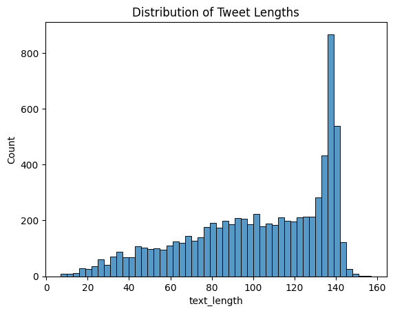
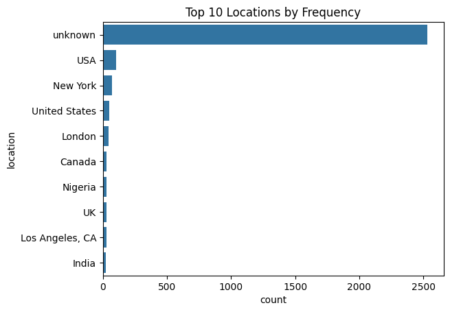

# 🌪️ NLP Disaster Tweets Classification

## 📚 Table of Contents
1. [📝 Introduction](#introduction)
2. [🔍 Problem and Data Description](#problem-and-data-description)
3. [📊 Exploratory Data Analysis (EDA)](#exploratory-data-analysis-eda)
4. [🏗️ Model Architecture](#model-architecture)
5. [📈 Results and Analysis](#results-and-analysis)
6. [🏁 Conclusion](#conclusion)
7. [📚 References](#references)

## 📝 Introduction
This project aims to classify disaster-related tweets using Natural Language Processing techniques. It is a part of the Kaggle competition "Natural Language Processing with Disaster Tweets."

## 🔍 Problem and Data Description
The challenge is to build a machine learning model that predicts whether a given tweet is about a real disaster or not. The dataset consists of 10,000 tweets that have been manually classified. Each sample in the dataset includes the text of the tweet, a keyword from the tweet (if available), and the location the tweet was sent from (if available). [Link to Kaggle Competition](https://kaggle.com/competitions/nlp-getting-started).

## 📊 Exploratory Data Analysis (EDA)

### Loading the Data
Let's start by loading the data and taking a look at the first few rows.

```python
import pandas as pd
import matplotlib.pyplot as plt
import seaborn as sns

# Load the dataset
train_df = pd.read_csv('train.csv')
test_df = pd.read_csv('test.csv')

train_df.head()
```
### Data Cleaning Procedures
The data cleaning process involves filling in missing values for the 'keyword' and 'location' columns. Missing keywords are filled with 'none', and missing locations are filled with 'unknown'.

```python
# Data cleaning: fill missing values in 'keyword' and 'location' columns
train_df['keyword'].fillna('none', inplace=True)
train_df['location'].fillna('unknown', inplace=True)
```

### Data Visualization
We performed various visualizations to understand the data better:

1. **Distribution of Target Variable:**
   ```python
   # Display the distribution of the target variable
   sns.countplot(x='target', data=train_df)
   plt.title('Distribution of Target Variable')
   plt.show()
   ```
   

   The distribution of the target variable reveals that there are more non-disaster tweets (labeled as 0) compared to disaster-related tweets (labeled as 1). This class imbalance is crucial to consider as it can affect the model's performance. Techniques such as resampling, adjusting class weights, or using specific evaluation metrics will be necessary to handle this imbalance.

2. **Distribution of Tweet Lengths:**
   ```python
   # Display the distribution of tweet lengths
   train_df['text_length'] = train_df['text'].apply(len)
   sns.histplot(train_df['text_length'], bins=50)
   plt.title('Distribution of Tweet Lengths')
   plt.show()
   ```
   

   The distribution of tweet lengths shows that most tweets are around 120 to 140 characters long. This is expected given the character limit on Twitter. Understanding the length of tweets can help in preprocessing, such as padding or truncating tweets to a fixed length when feeding them into the model.

3. **Top 10 Keywords by Frequency:**
   ```python
   # Display the distribution of keyword occurrences
   sns.countplot(y='keyword', data=train_df, order=train_df['keyword'].value_counts().iloc[:10].index)
   plt.title('Top 10 Keywords by Frequency')
   plt.show()
   ```
   

   The top 10 keywords by frequency include terms like 'fatalities', 'deluge', 'armageddon', and 'sinking', which are strongly associated with disasters. Keywords can serve as important features for the model, providing context about the content of the tweets.

4. **Top 10 Locations by Frequency:**
   ```python
   # Display the distribution of locations
   sns.countplot(y='location', data=train_df, order=train_df['location'].value_counts().iloc[:10].index)
   plt.title('Top 10 Locations by Frequency')
   plt.show()
   ```
   

   The distribution of locations shows that most tweets are from the USA, New York, and other prominent locations. Location data can help in understanding regional patterns in disaster reporting and may enhance the model's ability to correctly classify tweets based on where they originate.

### Plan of Analysis
Based on the exploratory data analysis, the plan for analysis includes:

1. **Text Preprocessing:**
   - Tokenization
   - Stopword removal
   - Stemming/Lemmatization
   - Vectorization (e.g., TF-IDF)

2. **Feature Engineering:**
   - Creating features from tweet lengths, keyword, and location data
   - Exploring additional features like sentiment scores

3. **Model Selection and Training:**
   - Experimenting with various models like Logistic Regression, Naive Bayes, and different neural network architectures
   - Hyperparameter tuning and model optimization

4. **Evaluation:**
   - Evaluating models using metrics like F1-score, precision, recall, and accuracy
   - Analyzing results and refining models based on performance

## 🏗️ Model Architecture

### Model Description and Reasoning

**TF-IDF Vectorization:**
TF-IDF (Term Frequency-Inverse Document Frequency) is a statistical measure used to evaluate the importance of a word in a document relative to a collection of documents (corpus). The TF-IDF value increases proportionally to the number of times a word appears in the document but is offset by the frequency of the word in the corpus, which helps to adjust for the fact that some words appear more frequently in general.

**Neural Network with LSTM:**
We built and trained a sequential neural network using Long Short-Term Memory (LSTM) layers. LSTMs are a type of Recurrent Neural Network (RNN) architecture that are well-suited for sequential data like text because they can capture long-term dependencies. Unlike traditional RNNs, LSTMs are capable of learning and remembering over long sequences, which is crucial for understanding context in text data where the meaning of a word often depends on the words preceding and following it. This ability to retain information over longer periods makes LSTMs particularly effective for natural language processing tasks, such as text classification, where understanding the sequence of words is essential.

We chose LSTM for our model due to its effectiveness in handling the vanishing gradient problem, which is a common issue in standard RNNs. The LSTM architecture includes gates that regulate the flow of information, allowing it to maintain long-term dependencies without losing important information over time. This makes LSTMs more robust for tasks involving longer text sequences. By incorporating bidirectional LSTM layers, our model can capture context from both past and future states, further enhancing its understanding of the text. This bidirectional approach ensures that the model has a more comprehensive view of the text data, improving its ability to accurately classify disaster-related tweets.

### Code for Sequential Neural Network with LSTM

**Import necessary libraries:**
```python
import numpy as np
import pandas as pd
from sklearn.model_selection import train_test_split
from tensorflow.keras.preprocessing.text import Tokenizer
from tensorflow.keras.preprocessing.sequence import pad_sequences
from tensorflow.keras.models import Sequential
from tensorflow.keras.layers import Embedding, LSTM, Dense, Dropout, Bidirectional
from tensorflow.keras.optimizers import Adam
```

**Load and preprocess the dataset:**
```python
# Load the dataset
train_df = pd.read_csv('train.csv')

# Data preprocessing
train_df['keyword'].fillna('none', inplace=True)
train_df['location'].fillna('unknown', inplace=True)
train_df['text'] = train_df['text'].str.lower()

# Split the data into training and testing sets
X = train_df['text']
y = train_df['target']
X_train, X_test, y_train, y_test = train_test_split(X, y, test_size=0.2, random_state=42)
```

**Tokenize and pad sequences:**
```python
# Tokenize the text
tokenizer = Tokenizer(num_words=10000, oov_token='<OOV>')
tokenizer.fit_on_texts(X_train)
word_index = tokenizer.word_index

# Convert text to sequences and pad them
X_train_sequences = tokenizer.texts_to_sequences(X_train)
X_test_sequences = tokenizer.texts_to_sequences(X_test)
X_train_padded = pad_sequences(X_train_sequences, maxlen=100, padding='post', truncating='post')
X_test_padded = pad_sequences(X_test_sequences, maxlen=100, padding='post', truncating='post')
```

**Build and compile the LSTM model:**
```python
# Build the LSTM model
model = Sequential([
    Embedding(input_dim=10000, output_dim=64, input_length=100),
    Bidirectional(LSTM(64, return_sequences=True)),
    Dropout(0.5),
    Bidirectional(LSTM(64)),
    Dropout(0.5),
    Dense(64, activation='relu'),
    Dropout(0.5),
    Dense(1, activation='sigmoid')
])

# Compile the model
model.compile(loss='binary_crossentropy', optimizer=Adam(learning_rate=0.001), metrics=['accuracy'])
model.summary()
```

**Train the model:**
```python
# Train the model
history = model.fit(
    X_train_padded, y_train,
    epochs=10,
    batch_size=32,
    validation_data=(X_test_padded, y_test),
    verbose=2
)
```

**Evaluate the model:**
```python
# Evaluate the model
loss, accuracy = model.evaluate(X_test_padded, y_test, verbose=2)
print(f'LSTM Model Accuracy: {accuracy}')
```

The LSTM model showed promising performance with a final accuracy of 76.43% on the test set. The model architecture included an embedding layer, followed by bidirectional LSTM layers, dropout layers to prevent overfitting, and dense layers for final classification. Despite achieving high training accuracy, the validation accuracy indicated some overfitting, as evidenced by the increasing loss and slight decline in validation accuracy over epochs. This model’s ability to capture sequential dependencies in the text data through LSTM layers demonstrates its effectiveness for the text classification task, though further tuning and regularization might improve its generalization to unseen data.

## 📈 Results and Analysis


## 🏁 Conclusion


## 📚 References
- Howard, A., devrishi, Culliton, P., & Guo, Y. (2019). Natural Language Processing with Disaster Tweets. Kaggle. Retrieved from [https://kaggle.com/competitions/nlp-getting-started](https://kaggle.com/competitions/nlp-getting-started).